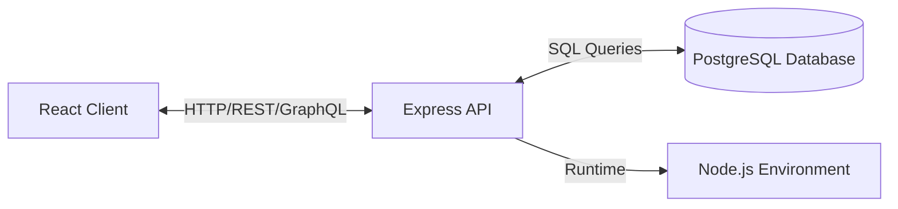

# What is the PERN Stack?

The PERN stack is a collection of robust technologies used to build full-stack web applications. It consists of:

*   **P**ostgreSQL: The relational database management system (RDBMS).
*   **E**xpress: The web framework for Node.js.
*   **R**eact: The frontend library for user interfaces.
*   **N**ode.js: The JavaScript runtime environment.

## Why Choose PERN?

Unlike the MERN stack (which uses MongoDB), PERN leverages the power of a relational database.

1.  **ACID Compliance**: PostgreSQL offers strong data integrity guarantees, which is crucial for applications handling financial data, strict relationships, or complex state.
2.  **Structured Data**: While NoSQL is flexible, most business data is inherently relational (e.g., Users have Orders, Orders have Products). SQL handles this naturally.
3.  **JavaScript Everywhere**: You write JavaScript (or TypeScript) for both the frontend and backend, unifying the developer experience and allowing for code sharing (types, utilities).
4.  **Ecosystem Maturity**: All four technologies are industry standards with massive community support, stable LTS versions, and rich libraries.

## The Architecture

### 1. PostgreSQL (The Data Layer)
Stores your data in tables with strict schemas. It handles data validity, constraints, and complex queries.

### 2. Express & Node.js (The Application Layer)
Node.js allows JavaScript to run on the server. Express sits on top of Node to handle routing, middleware, and request logic. It acts as the bridge between your data and your user interface.

### 3. React (The Presentation Layer)
A component-based library that renders the user interface. It consumes APIs provided by Express to display data and handles user interactions.

## Roadmap to Senior Mastery

This handbook is designed not just to teach you the syntax, but the *patterns*. To go from Junior to Senior, you need to understand:
*   **Database Design**: Normalization, indexing, and query optimization.
*   **Backend Architecture**: Separation of concerns, security, and scalability.
*   **React Performance**: Rendering lifecycles, state management patterns, and optimization.
*   **DevOps**: Testing, CI/CD, and containerization.

Let's begin the journey.

---
[Next Section →](./02-environment-setup.md)
